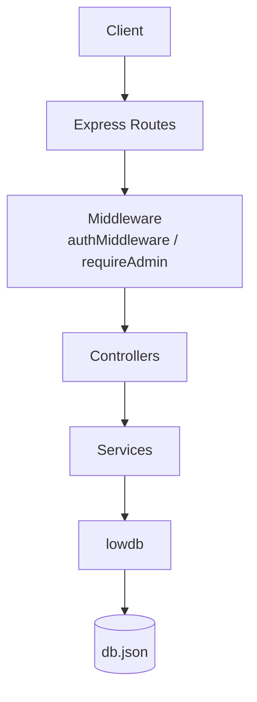
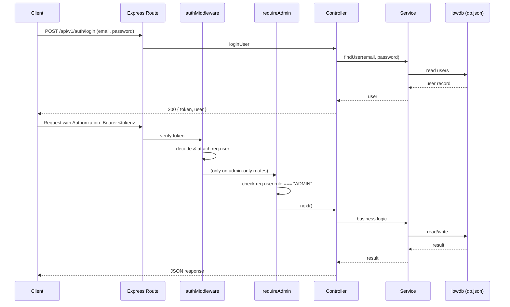

# Smart Task Manager Backend

A REST API backend for a task management system, built with **Node.js**, **Express.js**, and **lowdb**. It provides JWT-based authentication, role-based authorization (Admin / User), user management, task management with priority and status tracking, task assignment, query-based filtering, and task dependency handling.

This document describes the backend/API implementation only, as it currently exists in source. Features that are not implemented are explicitly called out as **not implemented** rather than omitted.

---

## Table of Contents

1. [Tech Stack](#tech-stack)
2. [Project Structure](#project-structure)
3. [Architecture](#architecture)
4. [Authentication & Authorization](#authentication--authorization)
5. [Database](#database)
6. [Environment Variables](#environment-variables)
7. [Setup Instructions](#setup-instructions)
8. [API Reference](#api-reference)
   - [Health](#health)
   - [Auth & User Endpoints](#auth--user-endpoints)
   - [Task Endpoints](#task-endpoints)
9. [Business Rules](#business-rules)
10. [Error Handling Reference](#error-handling-reference)
11. [API Testing Workflow](#api-testing-workflow)
12. [Security Notes](#security-notes)
13. [Limitations & Future Improvements](#limitations--future-improvements)
14. [API Summary Table](#api-summary-table)

---

## Tech Stack

| Category | Technology |
|---|---|
| Runtime | Node.js |
| Framework | Express.js 5 |
| Module system | ES Modules (`"type": "module"`) |
| Persistence | lowdb (JSON file) |
| Authentication | JSON Web Tokens (`jsonwebtoken`) |
| Cross-origin support | `cors` |
| Environment config | `dotenv` |
| Dev tooling | `nodemon` |

Dependencies as declared in `package.json`:

```json
"dependencies": {
  "cors": "^2.8.6",
  "dotenv": "^18.0.4",
  "express": "^5.2.1",
  "jsonwebtoken": "^9.0.3",
  "lowdb": "^7.0.1"
},
"devDependencies": {
  "nodemon": "^3.1.14"
}
```

No other runtime packages (e.g. password hashing libraries, validation libraries, logging libraries) are present in the dependency list.

---

## Project Structure

```
server/
├── src/
│   ├── controller/
│   │   ├── auth.controller.js     # Request/response handling for auth & user routes
│   │   └── task.controller.js     # Request/response handling for task routes
│   ├── data/
│   │   └── db.json                # lowdb JSON data file (users + tasks)
│   ├── db/
│   │   └── db.js                  # lowdb instance + initialization
│   ├── middleware/
│   │   ├── auth.middleware.js     # JWT verification
│   │   └── role.middleware.js     # Admin role enforcement
│   ├── routes/
│   │   ├── auth.route.js          # /api/v1/auth routes
│   │   └── task.route.js          # /api/v1/tasks routes
│   ├── services/
│   │   ├── auth.service.js        # Business logic for users
│   │   └── task.service.js        # Business logic for tasks
│   └── utils/
│       └── token.js               # JWT sign/verify helpers
├── index.js                       # App entry point
├── .env                           # Environment variables (not committed)
├── .gitignore
├── nodemon.json
└── package.json
```

---

## Architecture

The backend follows a layered request-handling flow: **routes → middleware → controllers → services → database**.



### Responsibilities

| Layer | Responsibility |
|---|---|
| **`index.js`** | Application entry point. Loads environment variables, configures Express, applies global middleware (`cors`, `express.json`), registers the `/health` route and the two routers, initializes the database, and starts the HTTP listener. |
| **`routes/`** | Defines the URL paths for each resource and wires each path to the appropriate middleware chain and controller function. Contains no business logic. |
| **`controller/`** | Adapts HTTP requests into service calls and service results into HTTP responses. Extracts `req.body`, `req.params`, `req.query`, and `req.user`; calls the relevant service function; and maps the result (or thrown error) to a JSON response and status code. Contains no direct database access. |
| **`services/`** | Contains the actual business logic and validation rules (e.g. checking that a priority is valid, that a dependency exists, that a user isn't the last admin). Services read from and write to the lowdb instance directly. |
| **`middleware/`** | Cross-cutting request processing that runs before a controller: `authMiddleware` verifies the JWT and populates `req.user`; `requireAdmin` checks that `req.user.role` is `ADMIN`. |
| **`utils/`** | Small, reusable helper functions unrelated to a specific resource — currently JWT signing (`generateToken`) and verification (`verifyToken`). |
| **`db/`** | Initializes and exports the lowdb database instance (`db.js`), including the default shape (`{ users: [], tasks: [] }`) used on first run. |
| **`data/`** | Holds the actual JSON data file (`db.json`) that lowdb reads from and writes to. |

### Why controllers and services are separated

Controllers are intentionally thin — they only deal with the HTTP layer (request parsing, response shaping, status codes). Services hold the actual business rules and are plain async functions with no knowledge of Express, `req`, or `res`. This separation keeps validation and business logic (e.g. dependency checks, role checks, admin-safety checks) independent of the transport layer, and is the only architectural pattern the codebase actually implements — there is no separate repository layer, no dependency-injection container, and no ORM abstraction.

---

## Authentication & Authorization

### Flow



### JWT login

`POST /api/v1/auth/login` accepts `email` and `password`, verifies them against the stored user record, and — on success — issues a signed JWT.

### Token generation

Tokens are generated in `src/utils/token.js` using `jsonwebtoken`:

```js
jwt.sign(
  { userId: user.id, role: user.role },
  process.env.JWT_SECRET,
  { expiresIn: "7d" }
);
```

### Token payload

The JWT payload contains exactly:

```json
{
  "userId": "<user id>",
  "role": "ADMIN | USER"
}
```

No email, name, or other personal data is embedded in the token. Tokens expire after **7 days**.

### Authorization header

Protected endpoints require the token to be sent as:

```
Authorization: Bearer <JWT_TOKEN>
```

### `authMiddleware`

Implemented in `src/middleware/auth.middleware.js`. For every protected route it:

1. Reads `req.headers.authorization`. If missing → `401 Authorization header is required`.
2. Splits the header into `scheme` and `token`. If the scheme isn't `Bearer` or the token is missing → `401 Invalid authorization format`.
3. Verifies the token with `verifyToken` (`jwt.verify`). If verification fails (invalid signature, malformed token, or expired) → `401 Invalid or expired token`.
4. On success, attaches the decoded payload to `req.user` and calls `next()`.

> **Implementation note:** `authMiddleware` currently logs the incoming auth header, scheme, token presence, decoded payload, and `req.user` to the console (`console.log`). This is verbose debug output left in the current implementation and is not structured/production logging.

### `requireAdmin`

Implemented in `src/middleware/role.middleware.js`. Runs **after** `authMiddleware` on admin-only routes:

1. If `req.user` is missing → `401 Authentication required` (defensive check; in practice this route is never reached without `authMiddleware` running first).
2. If `req.user.role !== "ADMIN"` → `403 Admin access required`.
3. Otherwise calls `next()`.

### 401 vs 403

| Status | Meaning | When it's used here |
|---|---|---|
| **401 Unauthorized** | Authentication is missing, malformed, or invalid — the server doesn't know *who* you are. | No `Authorization` header, wrong scheme, or invalid/expired token. |
| **403 Forbidden** | You are authenticated, but not allowed to perform this action — the server knows who you are but denies the action. | A valid, authenticated non-admin user calls an admin-only route (via `requireAdmin`). |

> **Note on consistency:** the `401`/`403` distinction above applies strictly to `authMiddleware`/`requireAdmin`. Some *service-level* authorization checks (e.g. a user trying to view or update a task that isn't theirs) are currently surfaced with **400/404** status codes rather than 403, because the controller layer for those routes maps all thrown service errors to a single status code. This is documented precisely per-endpoint in the [API Reference](#api-reference) and called out again in [Limitations](#limitations--future-improvements).

---

## Database

The backend uses **lowdb**, a lightweight JSON-file database, configured in `src/db/db.js`:

```js
const adapter = new JSONFile("./src/data/db.json");
export const db = new Low(adapter, { users: [], tasks: [] });
```

On startup, `initDb()` reads `db.json`, seeds the default shape (`{ users: [], tasks: [] }`) if the file is empty, and writes it back.

Data shape:

```json
{
  "users": [
    {
      "id": "string (UUID or seed id)",
      "name": "string",
      "email": "string",
      "password": "string",
      "role": "ADMIN | USER"
    }
  ],
  "tasks": [
    {
      "id": "string (UUID)",
      "title": "string",
      "description": "string",
      "priority": "LOW | MEDIUM | HIGH",
      "status": "TODO | IN_PROGRESS | DONE",
      "assignedTo": "string (user id)",
      "createdBy": "string (user id)",
      "dependencies": ["string (task id)", "..."],
      "createdAt": "ISO 8601 timestamp",
      "updatedAt": "ISO 8601 timestamp"
    }
  ]
}
```

The project ships with one bootstrap **seed admin account** in `db.json` so the API can be exercised immediately:

| Field | Value |
|---|---|
| email | `admin@example.com` |
| password | `admin123` |
| role | `ADMIN` |

> This account exists purely to bootstrap and test the application locally. It is plain seed/test data, not a production credential, and should never be reused in a real deployment. New users created afterward through the API are always created with the `USER` role — there is no endpoint to create an additional admin.

**`.gitignore` note:** the current `.gitignore` excludes `node_modules` and `.env`, but **does not exclude `src/data/db.json`**. This means the runtime data file (including the seed admin's plaintext password) is not automatically excluded from version control. If this project is pushed to a shared or public repository, `db.json` should be added to `.gitignore` and the seed data treated as disposable local/test data — not production data.

lowdb is intentionally used here for its simplicity and zero-setup nature, which is appropriate for an assignment/prototype. It is **not** a production-grade database (no transactions, no concurrent write safety, no indexing/querying beyond in-memory array filtering). For a production system, a proper database (e.g. PostgreSQL or MongoDB) would be the appropriate choice — see [Limitations](#limitations--future-improvements).

---

## Environment Variables

Declared usage found in the source code (`index.js`, `src/utils/token.js`):

| Variable | Used in | Purpose | Required |
|---|---|---|---|
| `PORT` | `index.js` | Port the Express server listens on | Yes |
| `JWT_SECRET` | `src/utils/token.js` | Secret key used to sign and verify JWTs | Yes |

No `.env.example` file is present in the repository. Example `.env` (do not commit real values):

```env
PORT=4000
JWT_SECRET=replace-with-a-strong-random-secret
```

No other environment variables (database URLs, third-party API keys, CORS origin lists, etc.) are read anywhere in the codebase.

---

## Setup Instructions

```bash
# 1. Clone the repository
git clone <repository-url>

# 2. Navigate to the backend directory
cd server

# 3. Install dependencies
npm install

# 4. Configure environment variables
# Create a .env file in the server/ directory:
echo "PORT=4000" >> .env
echo "JWT_SECRET=your-secret-here" >> .env

# 5. Start the development server (auto-restarts via nodemon)
npm run dev

# 6. (Alternative) Start in production mode
npm start
```

These are the exact scripts defined in `package.json`:

```json
"scripts": {
  "test": "echo \"Error: no test specified\" && exit 1",
  "dev": "nodemon index.js",
  "start": "node index.js"
}
```

> There is no separate `build` step — this is a plain Node.js/Express app with no compilation or bundling. `npm test` is a placeholder and always exits with an error; no automated tests are currently implemented.

### 7. Verify the health endpoint

```bash
curl http://localhost:4000/health
```

Expected response:

```json
{
  "status": true,
  "message": "Task manager api is running"
}
```

---

## API Reference

Base URL: `http://localhost:4000`
API prefix: `/api/v1`

All request/response bodies are JSON (`Content-Type: application/json`).

### Health

#### `GET /health`

| | |
|---|---|
| **Purpose** | Basic liveness check for the API. |
| **Method** | `GET` |
| **Full URL** | `http://localhost:4000/health` |
| **Authentication** | Not required |
| **Authorization** | None |
| **Headers** | None required |
| **Request body** | None |
| **Query params** | None |
| **Path params** | None |
| **Status code** | `200 OK` |
| **Error responses** | None |

**Example request (cURL):**
```bash
curl http://localhost:4000/health
```

**Example request (PowerShell):**
```powershell
Invoke-RestMethod -Uri "http://localhost:4000/health" -Method Get
```

**Example response:**
```json
{
  "status": true,
  "message": "Task manager api is running"
}
```

---

### Auth & User Endpoints

#### `POST /api/v1/auth/login`

| | |
|---|---|
| **Purpose** | Authenticate a user and issue a JWT. |
| **Method** | `POST` |
| **Full URL** | `http://localhost:4000/api/v1/auth/login` |
| **Authentication** | Not required |
| **Authorization** | None |
| **Headers** | `Content-Type: application/json` |
| **Request body** | `{ "email": "string", "password": "string" }` |
| **Query params** | None |
| **Path params** | None |
| **Status code (success)** | `200 OK` |
| **Status code (failure)** | `401 Unauthorized` (used for **all** login errors, including missing fields) |
| **Error responses** | `All fields are required` · `Invalid email or password` |
| **Authorization restrictions** | None — open endpoint |

**Example request (cURL):**
```bash
curl -X POST http://localhost:4000/api/v1/auth/login \
  -H "Content-Type: application/json" \
  -d '{"email":"admin@example.com","password":"admin123"}'
```

**Example request (PowerShell):**
```powershell
$body = @{ email = "admin@example.com"; password = "admin123" } | ConvertTo-Json
Invoke-RestMethod -Uri "http://localhost:4000/api/v1/auth/login" -Method Post -Body $body -ContentType "application/json"
```

**Example response (200):**
```json
{
  "success": true,
  "message": "Login successful",
  "token": "eyJhbGciOiJIUzI1NiIs...",
  "user": {
    "id": "admin-001",
    "name": "System Admin",
    "email": "admin@example.com",
    "role": "ADMIN"
  }
}
```

**Example error response (401):**
```json
{
  "success": false,
  "message": "Invalid email or password"
}
```

---

#### `POST /api/v1/auth/users`

| | |
|---|---|
| **Purpose** | Create a new user account (always created with role `USER`). |
| **Method** | `POST` |
| **Full URL** | `http://localhost:4000/api/v1/auth/users` |
| **Authentication** | Required (`Authorization: Bearer <token>`) |
| **Authorization** | Admin only (`requireAdmin`) |
| **Headers** | `Content-Type: application/json`, `Authorization: Bearer <JWT_TOKEN>` |
| **Request body** | `{ "name": "string", "email": "string", "password": "string" }` |
| **Query params** | None |
| **Path params** | None |
| **Status code (success)** | `201 Created` |
| **Status code (failure)** | `400 Bad Request` (validation errors) · `401`/`403` (from middleware) |
| **Error responses** | `Authorization header is required` · `Invalid authorization format` · `Invalid or expired token` · `Admin access required` · `All fields are required` · `Email already exists` |
| **Authorization restrictions** | Only users with role `ADMIN` may call this endpoint. |

**Example request (cURL):**
```bash
curl -X POST http://localhost:4000/api/v1/auth/users \
  -H "Content-Type: application/json" \
  -H "Authorization: Bearer <JWT_TOKEN>" \
  -d '{"name":"Jane Doe","email":"jane@example.com","password":"password123"}'
```

**Example request (PowerShell):**
```powershell
$headers = @{ Authorization = "Bearer <JWT_TOKEN>" }
$body = @{ name = "Jane Doe"; email = "jane@example.com"; password = "password123" } | ConvertTo-Json
Invoke-RestMethod -Uri "http://localhost:4000/api/v1/auth/users" -Method Post -Headers $headers -Body $body -ContentType "application/json"
```

**Example response (201):**
```json
{
  "success": true,
  "message": "User successfully created",
  "data": {
    "id": "b2b1f7f0-1a2b-4c3d-9e4f-5a6b7c8d9e0f",
    "name": "Jane Doe",
    "email": "jane@example.com",
    "role": "USER"
  }
}
```

Note: the response never includes the `password` field.

---

#### `GET /api/v1/auth/me`

| | |
|---|---|
| **Purpose** | Return the profile of the currently authenticated user. |
| **Method** | `GET` |
| **Full URL** | `http://localhost:4000/api/v1/auth/me` |
| **Authentication** | Required (`Authorization: Bearer <token>`) |
| **Authorization** | Any authenticated user (admin or regular user) |
| **Headers** | `Authorization: Bearer <JWT_TOKEN>` |
| **Request body** | None |
| **Query params** | None |
| **Path params** | None |
| **Status code (success)** | `200 OK` |
| **Status code (failure)** | `404 Not Found` (unexpected — e.g. user deleted after token issued) · `401` (from middleware) |
| **Error responses** | `Authorization header is required` · `Invalid authorization format` · `Invalid or expired token` · `User not found` |
| **Authorization restrictions** | None beyond being authenticated — every user can view their own profile only. |

**Example request (cURL):**
```bash
curl http://localhost:4000/api/v1/auth/me \
  -H "Authorization: Bearer <JWT_TOKEN>"
```

**Example request (PowerShell):**
```powershell
$headers = @{ Authorization = "Bearer <JWT_TOKEN>" }
Invoke-RestMethod -Uri "http://localhost:4000/api/v1/auth/me" -Method Get -Headers $headers
```

**Example response (200):**
```json
{
  "success": true,
  "data": {
    "id": "admin-001",
    "name": "System Admin",
    "email": "admin@example.com",
    "role": "ADMIN"
  }
}
```

---

#### `GET /api/v1/auth/users`

| | |
|---|---|
| **Purpose** | List all user accounts. |
| **Method** | `GET` |
| **Full URL** | `http://localhost:4000/api/v1/auth/users` |
| **Authentication** | Required (`Authorization: Bearer <token>`) |
| **Authorization** | Admin only (`requireAdmin`) |
| **Headers** | `Authorization: Bearer <JWT_TOKEN>` |
| **Request body** | None |
| **Query params** | None (no filtering implemented on this endpoint) |
| **Path params** | None |
| **Status code (success)** | `200 OK` |
| **Status code (failure)** | `500 Internal Server Error` (unexpected) · `401`/`403` (from middleware) |
| **Error responses** | `Authorization header is required` · `Invalid authorization format` · `Invalid or expired token` · `Admin access required` |
| **Authorization restrictions** | Only `ADMIN` users may call this endpoint. |

**Example request (cURL):**
```bash
curl http://localhost:4000/api/v1/auth/users \
  -H "Authorization: Bearer <JWT_TOKEN>"
```

**Example request (PowerShell):**
```powershell
$headers = @{ Authorization = "Bearer <JWT_TOKEN>" }
Invoke-RestMethod -Uri "http://localhost:4000/api/v1/auth/users" -Method Get -Headers $headers
```

**Example response (200):**
```json
{
  "success": true,
  "data": [
    {
      "id": "admin-001",
      "name": "System Admin",
      "email": "admin@example.com",
      "role": "ADMIN"
    },
    {
      "id": "b2b1f7f0-1a2b-4c3d-9e4f-5a6b7c8d9e0f",
      "name": "Jane Doe",
      "email": "jane@example.com",
      "role": "USER"
    }
  ]
}
```

Note: passwords are stripped from every entry before the response is sent.

---

#### `DELETE /api/v1/auth/users/:id`

| | |
|---|---|
| **Purpose** | Delete a user account. |
| **Method** | `DELETE` |
| **Full URL** | `http://localhost:4000/api/v1/auth/users/:id` |
| **Authentication** | Required (`Authorization: Bearer <token>`) |
| **Authorization** | Admin only (`requireAdmin`) |
| **Headers** | `Authorization: Bearer <JWT_TOKEN>` |
| **Request body** | None |
| **Query params** | None |
| **Path params** | `id` — the user's id |
| **Status code (success)** | `200 OK` |
| **Status code (failure)** | `400 Bad Request` (used for all business-rule failures below) · `401`/`403` (from middleware) |
| **Error responses** | `Authorization header is required` · `Invalid authorization format` · `Invalid or expired token` · `Admin access required` · `User not found` · `Cannot delete user with assigned tasks` · `Cannot delete the only admin` |
| **Authorization restrictions** | Only `ADMIN` users may call this endpoint. The current implementation does **not** contain a dedicated "cannot delete yourself" check — an admin can delete their own account through this endpoint as long as they are not the only remaining admin and have no tasks assigned to them. |

**Example request (cURL):**
```bash
curl -X DELETE http://localhost:4000/api/v1/auth/users/b2b1f7f0-1a2b-4c3d-9e4f-5a6b7c8d9e0f \
  -H "Authorization: Bearer <JWT_TOKEN>"
```

**Example request (PowerShell):**
```powershell
$headers = @{ Authorization = "Bearer <JWT_TOKEN>" }
Invoke-RestMethod -Uri "http://localhost:4000/api/v1/auth/users/b2b1f7f0-1a2b-4c3d-9e4f-5a6b7c8d9e0f" -Method Delete -Headers $headers
```

**Example response (200):**
```json
{
  "success": true,
  "message": "User successfully deleted"
}
```

**Example error response (400):**
```json
{
  "success": false,
  "message": "Cannot delete user with assigned tasks"
}
```

---

### Task Endpoints

#### `POST /api/v1/tasks`

| | |
|---|---|
| **Purpose** | Create a new task and assign it to a user. |
| **Method** | `POST` |
| **Full URL** | `http://localhost:4000/api/v1/tasks` |
| **Authentication** | Required (`Authorization: Bearer <token>`) |
| **Authorization** | Admin only (`requireAdmin`) |
| **Headers** | `Content-Type: application/json`, `Authorization: Bearer <JWT_TOKEN>` |
| **Request body** | `{ "title": "string", "description": "string (optional)", "priority": "LOW\|MEDIUM\|HIGH", "assignedTo": "string (user id)", "dependencies": ["string (task id)", "..."] (optional, defaults to []) }` |
| **Query params** | None |
| **Path params** | None |
| **Status code (success)** | `201 Created` |
| **Status code (failure)** | `400 Bad Request` · `401`/`403` (from middleware) |
| **Error responses** | `Authorization header is required` · `Invalid authorization format` · `Invalid or expired token` · `Admin access required` · `Task title is required` · `Task priority is required` · `Invalid task priority` · `Assigned user not found` · `Only admin users can create tasks` · `One or more dependency tasks do not exist` |
| **Authorization restrictions** | Only `ADMIN` users may create tasks. (The `Only admin users can create tasks` message is an additional check inside the service layer; in practice the route-level `requireAdmin` middleware already blocks non-admins before this check is reached.) |

**Example request (cURL):**
```bash
curl -X POST http://localhost:4000/api/v1/tasks \
  -H "Content-Type: application/json" \
  -H "Authorization: Bearer <JWT_TOKEN>" \
  -d '{
    "title": "Set up CI pipeline",
    "description": "Configure GitHub Actions for build and test",
    "priority": "HIGH",
    "assignedTo": "b2b1f7f0-1a2b-4c3d-9e4f-5a6b7c8d9e0f",
    "dependencies": []
  }'
```

**Example request (PowerShell):**
```powershell
$headers = @{ Authorization = "Bearer <JWT_TOKEN>" }
$body = @{
  title = "Set up CI pipeline"
  description = "Configure GitHub Actions for build and test"
  priority = "HIGH"
  assignedTo = "b2b1f7f0-1a2b-4c3d-9e4f-5a6b7c8d9e0f"
  dependencies = @()
} | ConvertTo-Json
Invoke-RestMethod -Uri "http://localhost:4000/api/v1/tasks" -Method Post -Headers $headers -Body $body -ContentType "application/json"
```

**Example response (201):**
```json
{
  "success": true,
  "message": "Task successfully created and assigned",
  "data": {
    "id": "9d8c7b6a-5e4f-3d2c-1b0a-9f8e7d6c5b4a",
    "title": "Set up CI pipeline",
    "description": "Configure GitHub Actions for build and test",
    "priority": "HIGH",
    "status": "TODO",
    "assignedTo": "b2b1f7f0-1a2b-4c3d-9e4f-5a6b7c8d9e0f",
    "createdBy": "admin-001",
    "dependencies": [],
    "createdAt": "2026-09-26T10:15:00.000Z",
    "updatedAt": "2026-09-26T10:15:00.000Z"
  }
}
```

---

#### `GET /api/v1/tasks/mine`

| | |
|---|---|
| **Purpose** | Retrieve tasks assigned to the currently authenticated user. |
| **Method** | `GET` |
| **Full URL** | `http://localhost:4000/api/v1/tasks/mine` |
| **Authentication** | Required (`Authorization: Bearer <token>`) |
| **Authorization** | Any authenticated user |
| **Headers** | `Authorization: Bearer <JWT_TOKEN>` |
| **Request body** | None |
| **Query params** | `priority` (`LOW`\|`MEDIUM`\|`HIGH`, optional), `status` (`TODO`\|`IN_PROGRESS`\|`DONE`, optional) — both are supported here, combinable |
| **Path params** | None |
| **Status code (success)** | `200 OK` |
| **Status code (failure)** | `400 Bad Request` · `401` (from middleware) |
| **Error responses** | `Authorization header is required` · `Invalid authorization format` · `Invalid or expired token` |
| **Authorization restrictions** | Always scoped to `req.user.userId` — a user can only ever retrieve tasks assigned to themselves through this endpoint, regardless of role. |

**Example requests:**
```
GET /api/v1/tasks/mine
GET /api/v1/tasks/mine?priority=HIGH
GET /api/v1/tasks/mine?status=TODO
GET /api/v1/tasks/mine?priority=HIGH&status=TODO
```

**Example request (cURL):**
```bash
curl "http://localhost:4000/api/v1/tasks/mine?status=TODO" \
  -H "Authorization: Bearer <JWT_TOKEN>"
```

**Example request (PowerShell):**
```powershell
$headers = @{ Authorization = "Bearer <JWT_TOKEN>" }
Invoke-RestMethod -Uri "http://localhost:4000/api/v1/tasks/mine?status=TODO" -Method Get -Headers $headers
```

**Example response (200):**
```json
{
  "success": true,
  "message": "Tasks successfully received",
  "data": [
    {
      "id": "9d8c7b6a-5e4f-3d2c-1b0a-9f8e7d6c5b4a",
      "title": "Set up CI pipeline",
      "description": "Configure GitHub Actions for build and test",
      "priority": "HIGH",
      "status": "TODO",
      "assignedTo": "b2b1f7f0-1a2b-4c3d-9e4f-5a6b7c8d9e0f",
      "createdBy": "admin-001",
      "dependencies": [],
      "createdAt": "2026-09-26T10:15:00.000Z",
      "updatedAt": "2026-09-26T10:15:00.000Z"
    }
  ]
}
```

---

#### `GET /api/v1/tasks`

| | |
|---|---|
| **Purpose** | Retrieve all tasks in the system. |
| **Method** | `GET` |
| **Full URL** | `http://localhost:4000/api/v1/tasks` |
| **Authentication** | Required (`Authorization: Bearer <token>`) |
| **Authorization** | Admin only (`requireAdmin`) |
| **Headers** | `Authorization: Bearer <JWT_TOKEN>` |
| **Request body** | None |
| **Query params** | `priority` (`LOW`\|`MEDIUM`\|`HIGH`, optional), `status` (`TODO`\|`IN_PROGRESS`\|`DONE`, optional) — combinable |
| **Path params** | None |
| **Status code (success)** | `200 OK` |
| **Status code (failure)** | `500 Internal Server Error` (unexpected) · `401`/`403` (from middleware) |
| **Error responses** | `Authorization header is required` · `Invalid authorization format` · `Invalid or expired token` · `Admin access required` |
| **Authorization restrictions** | Only `ADMIN` users may call this endpoint. |

**Example requests:**
```
GET /api/v1/tasks?priority=HIGH
GET /api/v1/tasks?status=DONE
GET /api/v1/tasks?priority=HIGH&status=TODO
```

**Example request (cURL):**
```bash
curl "http://localhost:4000/api/v1/tasks?priority=HIGH&status=TODO" \
  -H "Authorization: Bearer <JWT_TOKEN>"
```

**Example request (PowerShell):**
```powershell
$headers = @{ Authorization = "Bearer <JWT_TOKEN>" }
Invoke-RestMethod -Uri "http://localhost:4000/api/v1/tasks?priority=HIGH&status=TODO" -Method Get -Headers $headers
```

**Example response (200):**
```json
{
  "success": true,
  "message": "Tasks successfully retrieved",
  "data": [
    {
      "id": "9d8c7b6a-5e4f-3d2c-1b0a-9f8e7d6c5b4a",
      "title": "Set up CI pipeline",
      "description": "Configure GitHub Actions for build and test",
      "priority": "HIGH",
      "status": "TODO",
      "assignedTo": "b2b1f7f0-1a2b-4c3d-9e4f-5a6b7c8d9e0f",
      "createdBy": "admin-001",
      "dependencies": [],
      "createdAt": "2026-09-26T10:15:00.000Z",
      "updatedAt": "2026-09-26T10:15:00.000Z"
    }
  ]
}
```

---

#### `GET /api/v1/tasks/:id`

| | |
|---|---|
| **Purpose** | Retrieve a single task by its id. |
| **Method** | `GET` |
| **Full URL** | `http://localhost:4000/api/v1/tasks/:id` |
| **Authentication** | Required (`Authorization: Bearer <token>`) |
| **Authorization** | Admin, or the user the task is assigned to |
| **Headers** | `Authorization: Bearer <JWT_TOKEN>` |
| **Request body** | None |
| **Query params** | None |
| **Path params** | `id` — the task's id |
| **Status code (success)** | `200 OK` |
| **Status code (failure)** | `404 Not Found` (used for **both** "task doesn't exist" and "not authorized to view this task") · `401` (from middleware) |
| **Error responses** | `Authorization header is required` · `Invalid authorization format` · `Invalid or expired token` · `Task ID is required` · `Task not found` · `You are not allowed to view this task` |
| **Authorization restrictions** | A regular (`USER`) caller may only view a task if `task.assignedTo` matches their own user id. `ADMIN` callers may view any task. |

**Example request (cURL):**
```bash
curl http://localhost:4000/api/v1/tasks/9d8c7b6a-5e4f-3d2c-1b0a-9f8e7d6c5b4a \
  -H "Authorization: Bearer <JWT_TOKEN>"
```

**Example request (PowerShell):**
```powershell
$headers = @{ Authorization = "Bearer <JWT_TOKEN>" }
Invoke-RestMethod -Uri "http://localhost:4000/api/v1/tasks/9d8c7b6a-5e4f-3d2c-1b0a-9f8e7d6c5b4a" -Method Get -Headers $headers
```

**Example response (200):**
```json
{
  "success": true,
  "message": "Task successfully retrieved",
  "data": {
    "id": "9d8c7b6a-5e4f-3d2c-1b0a-9f8e7d6c5b4a",
    "title": "Set up CI pipeline",
    "description": "Configure GitHub Actions for build and test",
    "priority": "HIGH",
    "status": "TODO",
    "assignedTo": "b2b1f7f0-1a2b-4c3d-9e4f-5a6b7c8d9e0f",
    "createdBy": "admin-001",
    "dependencies": [],
    "createdAt": "2026-09-26T10:15:00.000Z",
    "updatedAt": "2026-09-26T10:15:00.000Z"
  }
}
```

**Example error response (404, unauthorized viewer):**
```json
{
  "success": false,
  "message": "You are not allowed to view this task"
}
```

---

#### `PATCH /api/v1/tasks/:id/status`

| | |
|---|---|
| **Purpose** | Update the status of a task. |
| **Method** | `PATCH` |
| **Full URL** | `http://localhost:4000/api/v1/tasks/:id/status` |
| **Authentication** | Required (`Authorization: Bearer <token>`) |
| **Authorization** | Admin, or the user the task is assigned to |
| **Headers** | `Content-Type: application/json`, `Authorization: Bearer <JWT_TOKEN>` |
| **Request body** | `{ "status": "TODO\|IN_PROGRESS\|DONE" }` |
| **Query params** | None |
| **Path params** | `id` — the task's id |
| **Status code (success)** | `200 OK` |
| **Status code (failure)** | `400 Bad Request` (used for all errors below, including "not found" and "not authorized") · `401` (from middleware) |
| **Error responses** | `Authorization header is required` · `Invalid authorization format` · `Invalid or expired token` · `Task ID is required.` · `Task status is required.` · `Invalid task status` · `Task not found` · `You are not allowed to update this task` · `Cannot mark task as DONE because one or more dependencies are not completed` |
| **Authorization restrictions** | A regular (`USER`) caller may only update the status of a task where `task.assignedTo` matches their own user id. `ADMIN` callers may update any task's status. |

**Example request (cURL):**
```bash
curl -X PATCH http://localhost:4000/api/v1/tasks/9d8c7b6a-5e4f-3d2c-1b0a-9f8e7d6c5b4a/status \
  -H "Content-Type: application/json" \
  -H "Authorization: Bearer <JWT_TOKEN>" \
  -d '{"status":"IN_PROGRESS"}'
```

**Example request (PowerShell):**
```powershell
$headers = @{ Authorization = "Bearer <JWT_TOKEN>" }
$body = @{ status = "IN_PROGRESS" } | ConvertTo-Json
Invoke-RestMethod -Uri "http://localhost:4000/api/v1/tasks/9d8c7b6a-5e4f-3d2c-1b0a-9f8e7d6c5b4a/status" -Method Patch -Headers $headers -Body $body -ContentType "application/json"
```

**Example response (200):**
```json
{
  "success": true,
  "message": "Task status successfully updated",
  "data": {
    "id": "9d8c7b6a-5e4f-3d2c-1b0a-9f8e7d6c5b4a",
    "title": "Set up CI pipeline",
    "description": "Configure GitHub Actions for build and test",
    "priority": "HIGH",
    "status": "IN_PROGRESS",
    "assignedTo": "b2b1f7f0-1a2b-4c3d-9e4f-5a6b7c8d9e0f",
    "createdBy": "admin-001",
    "dependencies": [],
    "createdAt": "2026-09-26T10:15:00.000Z",
    "updatedAt": "2026-09-26T10:20:00.000Z"
  }
}
```

**Example error response (400, incomplete dependency):**
```json
{
  "success": false,
  "message": "Cannot mark task as DONE because one or more dependencies are not completed"
}
```

---

#### `DELETE /api/v1/tasks/:id`

| | |
|---|---|
| **Purpose** | Delete a task. |
| **Method** | `DELETE` |
| **Full URL** | `http://localhost:4000/api/v1/tasks/:id` |
| **Authentication** | Required (`Authorization: Bearer <token>`) |
| **Authorization** | Admin only (`requireAdmin`) |
| **Headers** | `Authorization: Bearer <JWT_TOKEN>` |
| **Request body** | None |
| **Query params** | None |
| **Path params** | `id` — the task's id |
| **Status code (success)** | `200 OK` |
| **Status code (failure)** | `400 Bad Request` · `401`/`403` (from middleware) |
| **Error responses** | `Authorization header is required` · `Invalid authorization format` · `Invalid or expired token` · `Admin access required` · `Task ID is required` · `Task not found` · `Cannot delete task because another task depends on it` |
| **Authorization restrictions** | Only `ADMIN` users may delete tasks. |

**Example request (cURL):**
```bash
curl -X DELETE http://localhost:4000/api/v1/tasks/9d8c7b6a-5e4f-3d2c-1b0a-9f8e7d6c5b4a \
  -H "Authorization: Bearer <JWT_TOKEN>"
```

**Example request (PowerShell):**
```powershell
$headers = @{ Authorization = "Bearer <JWT_TOKEN>" }
Invoke-RestMethod -Uri "http://localhost:4000/api/v1/tasks/9d8c7b6a-5e4f-3d2c-1b0a-9f8e7d6c5b4a" -Method Delete -Headers $headers
```

**Example response (200):**
```json
{
  "success": true,
  "message": "Task successfully deleted",
  "data": {
    "id": "9d8c7b6a-5e4f-3d2c-1b0a-9f8e7d6c5b4a",
    "title": "Set up CI pipeline",
    "description": "Configure GitHub Actions for build and test",
    "priority": "HIGH",
    "status": "IN_PROGRESS",
    "assignedTo": "b2b1f7f0-1a2b-4c3d-9e4f-5a6b7c8d9e0f",
    "createdBy": "admin-001",
    "dependencies": [],
    "createdAt": "2026-09-26T10:15:00.000Z",
    "updatedAt": "2026-09-26T10:20:00.000Z"
  }
}
```

**Example error response (400, referenced by another task):**
```json
{
  "success": false,
  "message": "Cannot delete task because another task depends on it"
}
```

---

## Business Rules

| # | Rule | Enforced in |
|---|---|---|
| 1 | Only admins can create users. | `requireAdmin` on `POST /auth/users` |
| 2 | Only admins can retrieve all users. | `requireAdmin` on `GET /auth/users` |
| 3 | Only admins can delete users. | `requireAdmin` on `DELETE /auth/users/:id` |
| 4 | There is no dedicated self-deletion restriction; an admin may delete their own account via `DELETE /auth/users/:id` as long as rules 5 and 6 don't block it. | *(not implemented as a distinct check — see Discrepancies)* |
| 5 | A user with assigned tasks cannot be deleted. | `auth.service.js → deleteUser` |
| 6 | The only remaining admin cannot be deleted. | `auth.service.js → deleteUser` |
| 7 | Only admins can create tasks. | `requireAdmin` on `POST /tasks`, plus a redundant service-level check |
| 8 | Admins assign tasks to users at creation time via `assignedTo`. | `task.service.js → createTask` |
| 9 | Normal users can view their own assigned tasks. | `GET /tasks/mine`, and `GET /tasks/:id` (ownership check) |
| 10 | Normal users can update the status of their own assigned tasks. | `PATCH /tasks/:id/status` (ownership check) |
| 11 | Users cannot view or update tasks assigned to other users. | `task.service.js → getTaskById`, `updateStatus` |
| 12 | Admins can view, create, and delete any task, and update the status of any task. | `requireAdmin` + admin bypass in ownership checks |
| 13 | A task cannot be marked `DONE` if one or more of its dependencies are not `DONE`. | `task.service.js → updateStatus` |
| 14 | A task cannot be deleted if another task depends on it. | `task.service.js → deleteTask` |
| 15 | Invalid dependency ids (ids that don't correspond to an existing task) are rejected at task-creation time. | `task.service.js → createTask` |

---

## Error Handling Reference

The table below lists error messages that actually exist in the codebase, the endpoint(s) that can produce them, and the **exact** HTTP status code the controller returns for each — which is not always the status you might expect from strict REST conventions (see the note under [401 vs 403](#401-vs-403)).

| Error message | Produced by | HTTP status |
|---|---|---|
| `Authorization header is required` | `authMiddleware` (any protected route) | 401 |
| `Invalid authorization format` | `authMiddleware` (any protected route) | 401 |
| `Invalid or expired token` | `authMiddleware` (any protected route) | 401 |
| `Authentication required` | `requireAdmin` (defensive; not reachable in normal flow) | 401 |
| `Admin access required` | `requireAdmin` (any admin-only route) | 403 |
| `All fields are required` | `POST /auth/login`, `POST /auth/users` | 401 (login) / 400 (create user) |
| `Invalid email or password` | `POST /auth/login` | 401 |
| `Email already exists` | `POST /auth/users` | 400 |
| `User not found` | `GET /auth/me`, `DELETE /auth/users/:id` | 404 (me) / 400 (delete) |
| `Cannot delete user with assigned tasks` | `DELETE /auth/users/:id` | 400 |
| `Cannot delete the only admin` | `DELETE /auth/users/:id` | 400 |
| `Task title is required` | `POST /tasks` | 400 |
| `Task priority is required` | `POST /tasks` | 400 |
| `Invalid task priority` | `POST /tasks` | 400 |
| `Assigned user not found` | `POST /tasks` | 400 |
| `Only admin users can create tasks` | `POST /tasks` (service-level; unreachable in practice due to `requireAdmin`) | 400 |
| `One or more dependency tasks do not exist` | `POST /tasks` | 400 |
| `Task not found` | `GET /tasks/:id`, `PATCH /tasks/:id/status`, `DELETE /tasks/:id` | 404 (get) / 400 (patch, delete) |
| `You are not allowed to view this task` | `GET /tasks/:id` | 404 |
| `You are not allowed to update this task` | `PATCH /tasks/:id/status` | 400 |
| `Invalid task status` | `PATCH /tasks/:id/status` | 400 |
| `Cannot mark task as DONE because one or more dependencies are not completed` | `PATCH /tasks/:id/status` | 400 |
| `Cannot delete task because another task depends on it` | `DELETE /tasks/:id` | 400 |

Every error response follows the same shape:

```json
{
  "success": false,
  "message": "<error message>"
}
```

---

## API Testing Workflow

This walkthrough matches the manual testing flow used during development (Postman / PowerShell / cURL).

1. **Start the server**
   ```bash
   npm run dev
   ```

2. **Verify health**
   ```bash
   curl http://localhost:4000/health
   ```

3. **Log in as the seed admin**
   ```bash
   curl -X POST http://localhost:4000/api/v1/auth/login \
     -H "Content-Type: application/json" \
     -d '{"email":"admin@example.com","password":"admin123"}'
   ```
   Copy the `token` value from the response.

4. **Use the admin token for subsequent admin-only calls**
   ```
   Authorization: Bearer <ADMIN_TOKEN>
   ```

5. **Create a regular user**
   ```bash
   curl -X POST http://localhost:4000/api/v1/auth/users \
     -H "Content-Type: application/json" \
     -H "Authorization: Bearer <ADMIN_TOKEN>" \
     -d '{"name":"Jane Doe","email":"jane@example.com","password":"password123"}'
   ```

6. **Log in as the new user** and copy their token
   ```bash
   curl -X POST http://localhost:4000/api/v1/auth/login \
     -H "Content-Type: application/json" \
     -d '{"email":"jane@example.com","password":"password123"}'
   ```

7. **Create a task as admin, assigned to Jane**
   ```bash
   curl -X POST http://localhost:4000/api/v1/tasks \
     -H "Content-Type: application/json" \
     -H "Authorization: Bearer <ADMIN_TOKEN>" \
     -d '{"title":"Write API docs","priority":"MEDIUM","assignedTo":"<JANE_USER_ID>"}'
   ```
   Copy the returned task `id` (call it `TASK_A`).

8. **Retrieve "My Tasks" as Jane**
   ```bash
   curl http://localhost:4000/api/v1/tasks/mine \
     -H "Authorization: Bearer <JANE_TOKEN>"
   ```

9. **Update task status as Jane**
   ```bash
   curl -X PATCH http://localhost:4000/api/v1/tasks/<TASK_A>/status \
     -H "Content-Type: application/json" \
     -H "Authorization: Bearer <JANE_TOKEN>" \
     -d '{"status":"IN_PROGRESS"}'
   ```

10. **Create a dependent task as admin** (depends on `TASK_A`)
    ```bash
    curl -X POST http://localhost:4000/api/v1/tasks \
      -H "Content-Type: application/json" \
      -H "Authorization: Bearer <ADMIN_TOKEN>" \
      -d '{"title":"Publish docs","priority":"LOW","assignedTo":"<JANE_USER_ID>","dependencies":["<TASK_A>"]}'
    ```
    Copy the returned task `id` (call it `TASK_B`).

11. **Verify the dependency restriction** — attempt to mark `TASK_B` as `DONE` while `TASK_A` is not yet `DONE`:
    ```bash
    curl -X PATCH http://localhost:4000/api/v1/tasks/<TASK_B>/status \
      -H "Content-Type: application/json" \
      -H "Authorization: Bearer <JANE_TOKEN>" \
      -d '{"status":"DONE"}'
    ```
    Expect a `400` response: `Cannot mark task as DONE because one or more dependencies are not completed`.

12. **Complete the dependency (`TASK_A`)**
    ```bash
    curl -X PATCH http://localhost:4000/api/v1/tasks/<TASK_A>/status \
      -H "Content-Type: application/json" \
      -H "Authorization: Bearer <JANE_TOKEN>" \
      -d '{"status":"DONE"}'
    ```

13. **Now complete the dependent task (`TASK_B`)**
    ```bash
    curl -X PATCH http://localhost:4000/api/v1/tasks/<TASK_B>/status \
      -H "Content-Type: application/json" \
      -H "Authorization: Bearer <JANE_TOKEN>" \
      -d '{"status":"DONE"}'
    ```

14. **Test filtering**
    ```bash
    curl "http://localhost:4000/api/v1/tasks?priority=LOW&status=DONE" \
      -H "Authorization: Bearer <ADMIN_TOKEN>"
    ```

15. **Test deletion and authorization**
    - Attempt to delete `TASK_A` as admin while `TASK_B` still depends on it → expect `400 Cannot delete task because another task depends on it`.
    - Attempt any admin-only call (e.g. `GET /api/v1/tasks`) using Jane's token → expect `403 Admin access required`.
    - Attempt any protected call with no `Authorization` header → expect `401 Authorization header is required`.

**Equivalent PowerShell pattern** for any of the calls above:
```powershell
$headers = @{ Authorization = "Bearer <TOKEN>" }
$body = @{ /* fields */ } | ConvertTo-Json
Invoke-RestMethod -Uri "http://localhost:4000/api/v1/<path>" -Method <Get|Post|Patch|Delete> -Headers $headers -Body $body -ContentType "application/json"
```

---

## Security Notes

This section describes the security model **as currently implemented** — not an idealized version of it.

- **Authentication:** JWT-based, using a single shared secret (`JWT_SECRET`) with `jsonwebtoken`. Tokens expire after 7 days.
- **Authorization:** Role-based, with two roles (`ADMIN`, `USER`), enforced via `authMiddleware` + `requireAdmin` at the route level, and via ownership checks (`assignedTo === req.user.userId`) at the service level for task-scoped endpoints.
- **Protected routes:** All routes except `GET /health` and `POST /api/v1/auth/login` require a valid Bearer token.
- **Password storage:** Passwords are currently stored and compared **in plain text** (`auth.service.js` does a direct string comparison, and `db.json` stores the raw password). This satisfies the assignment's mock-authentication requirement but is **not production-grade password storage** — there is no hashing (e.g. bcrypt/argon2) anywhere in the codebase.
- **Secrets:** `JWT_SECRET` and `PORT` are read from environment variables via `dotenv`. The JWT secret must never be committed to version control.
- **Seed/test data:** `db.json` ships with a seed admin account for local testing. This is test data, not production data, and should not be treated as such.
- **`.gitignore` gap:** `src/data/db.json` is currently **not** excluded by `.gitignore` (only `node_modules` and `.env` are). Since this file can contain plaintext user passwords once accounts are created, it should be added to `.gitignore` before this project is used with real data.

**Not implemented** (and not claimed to be implemented): password hashing, OAuth, refresh tokens, server-side sessions, HTTPS/TLS termination, rate limiting, request throttling, CSRF protection, or field-level encryption.

---

## Limitations & Future Improvements

The following are reasonable next steps, listed explicitly as **not currently implemented**:

- Replace lowdb with a proper database (e.g. PostgreSQL or MongoDB) for real persistence guarantees, concurrency safety, and indexing.
- Hash passwords (e.g. with bcrypt or argon2) instead of storing/comparing them in plain text.
- Add refresh tokens / token revocation instead of long-lived, non-revocable 7-day access tokens.
- Introduce a request validation library (e.g. Zod or Joi) instead of manual `if` checks in services.
- Add rate limiting to protect authentication endpoints from brute-force attempts.
- Add structured logging (e.g. `pino`/`winston`) and remove the ad-hoc `console.log` debug statements currently present in `auth.middleware.js` and `role.middleware.js`.
- Add automated tests (unit/integration) — `npm test` is currently a placeholder that always fails.
- Add OpenAPI/Swagger documentation generated from the actual routes.
- Standardize HTTP status codes for authorization/not-found failures (several endpoints currently return `400` or `404` for what are effectively `403`/`409` conditions — see the [Error Handling Reference](#error-handling-reference)).
- Support pagination on list endpoints (`GET /tasks`, `GET /tasks/mine`, `GET /auth/users`).
- Allow editing task fields beyond status (title, description, priority, assignment, dependencies).
- Introduce more granular permissions beyond the current binary `ADMIN`/`USER` role model.
- Add an explicit "cannot delete your own account" guard on `DELETE /api/v1/auth/users/:id`, distinct from the existing "only admin" and "has tasks" checks.
- Track `db.json` out of version control by default and provide a `.env.example` file.

---

## API Summary Table

| Method | Endpoint | Auth | Role | Purpose |
|---|---|---|---|---|
| GET | `/health` | No | — | Liveness check |
| POST | `/api/v1/auth/login` | No | — | Log in, receive JWT |
| POST | `/api/v1/auth/users` | Yes | Admin | Create a user |
| GET | `/api/v1/auth/me` | Yes | Any | Get current user profile |
| GET | `/api/v1/auth/users` | Yes | Admin | List all users |
| DELETE | `/api/v1/auth/users/:id` | Yes | Admin | Delete a user |
| POST | `/api/v1/tasks` | Yes | Admin | Create and assign a task |
| GET | `/api/v1/tasks/mine` | Yes | Any | List my assigned tasks (filterable) |
| GET | `/api/v1/tasks` | Yes | Admin | List all tasks (filterable) |
| GET | `/api/v1/tasks/:id` | Yes | Admin / assignee | Get a task by id |
| PATCH | `/api/v1/tasks/:id/status` | Yes | Admin / assignee | Update task status |
| DELETE | `/api/v1/tasks/:id` | Yes | Admin | Delete a task |